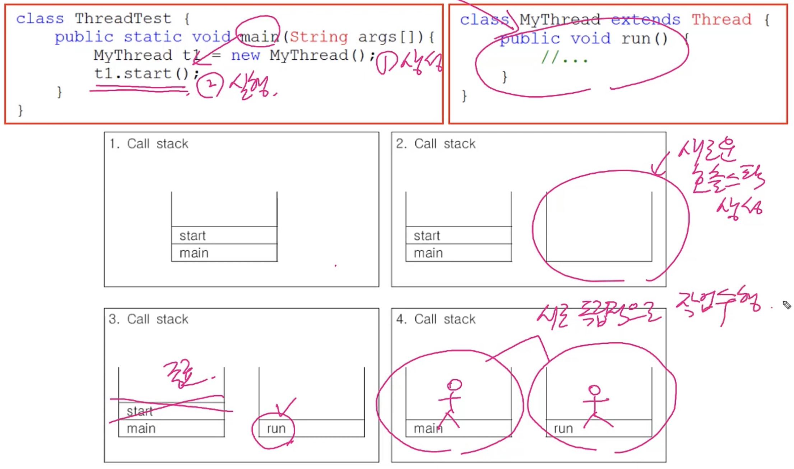

# < 쓰레드 >
## 1. 프로세스와 쓰레드
- 프로세스 : 실행중인 프로그램, 자원(메모리, CPU)과 쓰레드(실제 작업을 수행하는 것)로 구성
- 쓰레드 : 프로세스 내에서 실제 작업을 수행(가벼운 프로세스, 경량 프로세스라고 부르기도 함)
  - 모든 프로세스는 최소한 하나의 쓰레드를 가지고 있다
    ```
    프로세스 : 쓰레드 = 공장 : 일꾼
    싱글 쓰레드 프로세스 : 자원 + 쓰레드 = 쓰레드(일꾼) 1명
    멀티 쓰레드 프로세스 : 자원 + 쓰레드 + 쓰레드 + ... = 쓰레드(일꾼) n명
    ```
- 하나의 새로운 프로세스를 생성하는 것보다 하나의 새로운 쓰레드를 생성하는 것이 더 적은 비용이 든다.

## 2. 멀티쓰레드의 장단점
- 대부분의 프로그램이 멀티쓰레드로 작성되어 있다. 그러나 멀티쓰레드 프로그래밍이 장점만 있는 것은 아니다.
- 장점 (여러모로 좋다)
  1) 시스템 자원을 보다 효율적으로 사용할 수 있다.
  2) 사용자에 대한 응답성 향상 : 채팅프로그램에서 파일을 보내는 동시에 채팅도 할 수 있게 해줌
  3) 작업이 분리되어 코드가 간결해짐
  4) CPU의 사용률을 향상시킨다
  

- 단점 (프로그래밍 할 때 고려해야 될 사항들이 많다), (보통 공유하는대서 문제가 발생함)
  1) 동기화에 주의
  2) 교착상태가 발생하지 않도록 주의
  3) 각 쓰레드 가 효율적으로 고르게 실행될 수 있게 해야 한다. : 기아(굶어죽는 것)이 발생할 수 있음

## 3. 쓰레드의 구현과 실행
1) Thread클래스를 상속
2) Runnable인터페이스를 구현 - 이게 더 좋음

> 쓰레드의 실행
- 쓰레드를 생성한-1 후에 start()-2를 호출해야 쓰레드가 작업을 시작한다.
- start()는 먼저 실행된다고 먼저 실행되는건 아니고 OS스케줄러가 실행순서를 결정해주는데 그 순서로 된다.
- 한번 실행이 종료된 쓰레드는 다시 실행할 수 없다! 즉 하나의 쓰레드에 대해 start()가 한 번만 호출될 수 있다.

> start()와 run()
- 

## 4. main쓰레드
- main메서드의 코드를 수행하는 쓰레드
- 쓰레드는 '사용자 쓰레드'와 '데몬 쓰레드'(보조 쓰레드) 두 종류가 있다.
- 실행 중인 사용자 쓰레드가 하나도 없을 때 프로그램은 종료된다. (main메서드가 수행을 마쳤다하더라도 다른 쓰레드(Run())가 아직 잡업을 마치치 않은 상태라면 프로그램이 종료되지 않는다.)

## 5. 쓰레드의 I/O블락킹(blocking) : Input(입력) / Output(출력) = 입출력 
- 입출력시 작업 중단되는 것을 I/O블락킹 이라고 한다
- 멀티쓰레드는 블락킹구간에 멈춰있지 않고 다른 쓰레드에서 작업을 계속해서 진행한다.

## 6. 쓰레드의 우선순위(priority of thread)
- 작업의 중요도에 따라 쓰레드의 우선순위를 다르게 하여 특정 쓰레드가 더 많은 작업시간을 갖게 할 수 있다.
- Java에서는 쓰레드의 우선순위를 1~10까지 지정한다 근데 보통 우선순위는 5이다.(main메서드를 실행하는 우선순위가 5여서 main메서드에서 쓰레드를 생성하면 우선순위인 5를 상속받는다)
```
void setPriority(int newPriority(1~10중 원하는값)) : 쓰레드의 우선순위를 지정한 값으로 변경한다.
int getPriority() : 쓰레드의 우선순위를 반환한다.
```
- 우선순위는 쓰레드가 시작된 이후에도 변경할 수 있다.
- 우선순위가 같은 경우 : 비슷한 시간을 할당 받아서 작업을 진행
- A의 우선순위가 높은 경우 : A작업이 더 많은 시간을 할당받아서 진행되어 작업이 더 빨리 끝난다.

## 7. 쓰레드 그룹
- 서로 관련된 쓰레드 그룹으로 묶어서 다루기 위한 것
- 모든 쓰레드는 반드시 하나의 쓰레드 그룹에 포함되어 있어야 한다.
- 쓰레드 그룹을 지정하지 않고 생성한 쓰레드는 'main쓰레드 그룹'에 속한다.
- 자신을 생성한 쓰레드(부모 쓰레드)의 그룹과 우선순위를 상속받는다.

## 8. 데몬 쓰레드
- 일반 쓰레드의 작업을 돕는 보조적인 역할을 수행
- 일반 쓰레드가 모두 종료되면 자동적으로 종료된다.
- 가비지 컬렉터(GC), 자동저장, 화면 자동갱신 등에 사용된다.
- 무한루프와 조건문을 이용해서 실행 후 대기하다가 특정조건이 만족되면 작업을 수행하고 다시 대기하도록 작성한다(while로 무한루프를 하고, if로 조건을제시)(무한루프로 작성해도 일반쓰레드가 종료되면 자동으로 종료 됨)
- ```
  boolean isDaemon() : 쓰레드가 데몬 쓰레드인지 확인한다. 데몬 쓰레드이면 true를 반환
  void setDaemon(boolean on) : 쓰레드를 데몬 쓰레드로 또는 사용자 쓰레드로 변경 매개변수 on을 true로 지정하면 데몬 쓰레드가 된다.
  ```
* setDaemon(boolean on)은 반드시 start()를 호출하기 전에 실행되어야 한다. 그렇지 않으면 illegalThreadStateException이 발생한다.
