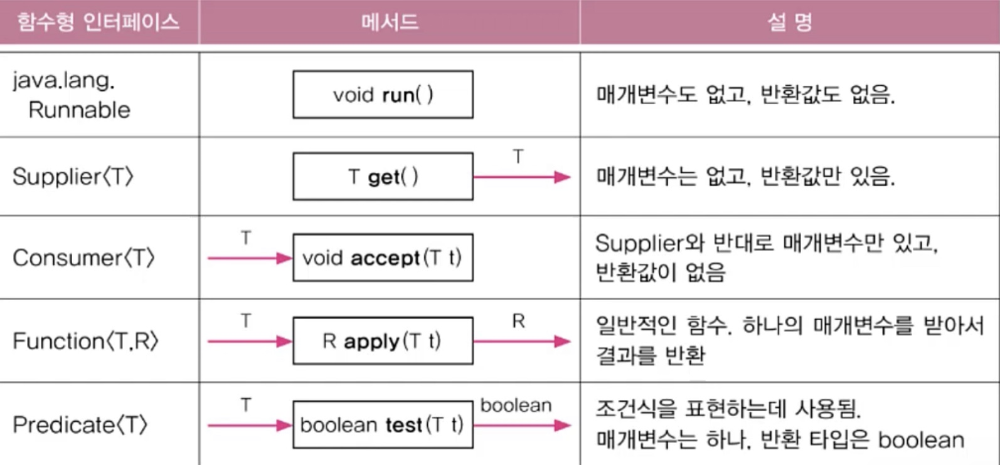
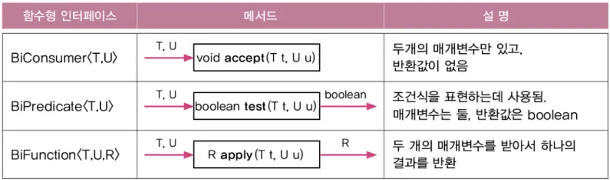
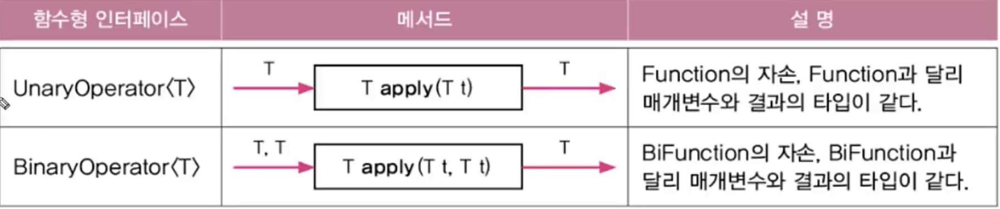
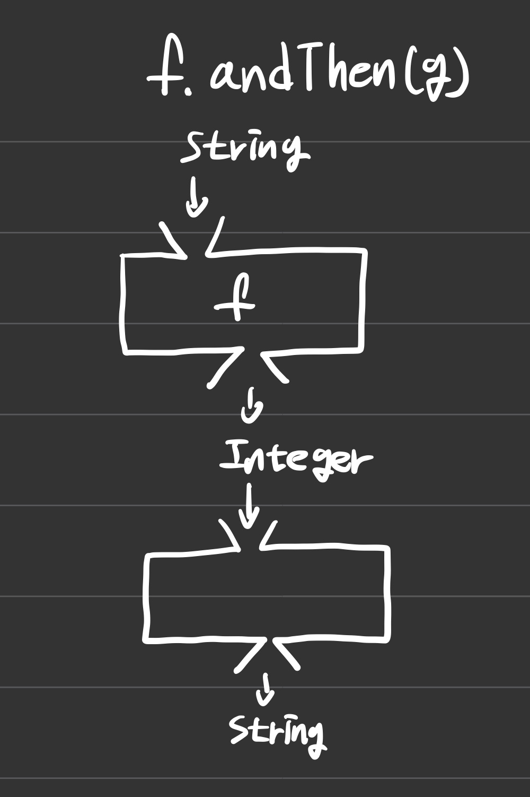
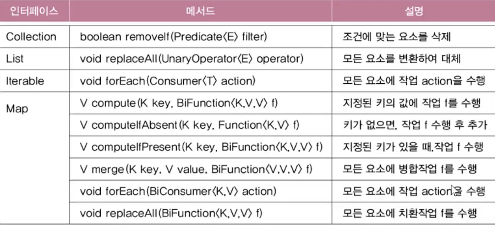

## < 람다식(Lambda expression) >
### 1. 람다식이란
- 함수(메서드)를 간단한 '식(expression)'으로 표현하는 방법
- 익명 함수(이름이 없는 함수, anonymous function) : 
  - 메서드를 람다식으로 바꾸는 방법 : 반환타입하고 이름을 지운다. 그리고 선언부와 구현부 사이에 화살표를 넣는다
- 함수와 메서드의 차이
  1) 근본적으로 동일. 함수는 일반적 용어, 메서느는 객체지향개념 용이
  2) 함수는 클래스에 독립적, 메서드는 클래스에 종속적

### 2. 람다식 작성하기
1. 메서드의 이름과 반환타입을 제거하고 '->'를 블록{} 앞에 추가한다.
2. 반환값이 있는 경우, 식이나 값만 적고 return문 생략가능(끝에 ';' 안 붙임)
3. 매개변수의 타입이 추론 가능하면 생략가능(대부분의 경우 생략 가능)
- 주의사항
  1) 매개변수가 하나인 경우 괄호() 생략가능(타입이 없을 때만)
  2) 블록 안의 문장이 하나뿐 일 때, 괄호{} 생략가능 (끝에 ';' 안 붙임)
  3) 단, 하나뿐인 문장이 return문이면 괄호{} 생략불가 (근데 대부분 생략함)

### 3. 람다식은 익명 함수? 익명 객체!
- 람다식은 익명 함수가 아니라 익명 객체이다.
- 람다식(익명 객체)을 다루기 위한 참조변수가 필요 참조변수 타입은?

### 4. 함수형 인터페이스
- 함수형 인터페이스 : 단 하나의 추상 메서드만 선언된 인터페이스
- 함수형 인터페이스 타입의 참조변수로 람다식을 참조할 수 있음
  - (단, 함수형 인터페이스의 메서드와 람다식의 매개변수 개수와 반환타입이 일치해야 함)

### 5. 함수형 인터페이스 - example
- 익명 객체를 람다식으로 대체 
- 함수형 인터페이스 타입의 매개변수
- 함수형 인터페이스 타입의 반환타입

### 6. java.util.function패키지
- 자주 사용되는 다양한 함수형 인터페이스 제공

- 매개변수가 2개인 함수형 인터페이스

- 매개변수 타입과 반환타입이 일치하는 함수형 인터페이스

### 7. Predicate의 결합
- and(), or(), negate()로 두 Predicate를 하나로 결합(default메서드)
  - ex)
```
Predicate<Integer> p = i -> i < 100;
Predicate<Integer> q = i -> i < 200;
Predicate<Integer> r = i -> i % 2 == 0;
- and(), or(), negate()
Predicate<Integer> notp = p.negate();     // i >= 100;
Predicate<Integer> all = notP.and(q).or(r);   //  100 <= i && i < 800 || i % 2 == 0
Predicate<Integer> all2 = not.and(q.or(r));   //  100 <= i && (i < 200 || i % 2 == 0)  

Predicate와 함께쓰는 test
System.out.println(all.test(2));    //  true
System.out.println(all2.test(2));   //  false
```

- 등가비교를 위한 Predicate의 작성에는 isEqual()를 사용(static메서드)

* Function의 합성
```
Function<String, Integer> f = (s) -> Integer.parseInt(s, 16);
Function<Integer, String> g = (i) -> Integer.toBinaryString(i);
일때

Function<String, String> h = f.andThen(g);
Function<Integer, Integer> h2 = f.compose(g);       //  compose는 g.andThen(f)와 같다
```


### 8. 컬렉션 프레임웍과 함수형 인터페이스
- 함수형 인터페이스를 사용하는 컬렉션 프레임웍의 메서드(와일드 카드 생략)


### 9. 메서드 참조(method reference)
- 하나의 메서드만 호출하는 람다식은 '메서드 참조'로 더 간단히 할 수 있다.
  - 클래스이름::메서드이름
1) static메서드 참조
```
Function<String, Integer> f = (String s) -> Integer.parseInt(s);
변환
Function<String, Integer> f = Integer::parseInt;
```

### 10. 생성자의 메서드 참조
- 생성자와 메서드 참조
```
생성자에 매개변수가 없이 출력만 하는 경우
Supplier<MyClass> s = () -> new MyClass();
변환
Supplier<MyClass> s = MyClass::new;

생성자에 매개변수가 있어서 입력과 출력 둘다 하는 경우
Function<Integer, MyClass> s = (i) -> new MyClass(i);   - 람다식
변환
Function<Integer, MyClass> s = MyClass::new;            - 메서드 참조
* 매개변수 2개일 때는 BiFunction<T, U, R> 사용 여기서 T,와 U가 입력 
```

- 배열과 메서드 참조
```
Function<Integer, int[]> f = x -> new int[x];   - 람다식
Function<Integer, int[]> f = int[]::new         - 메서드 참조
```