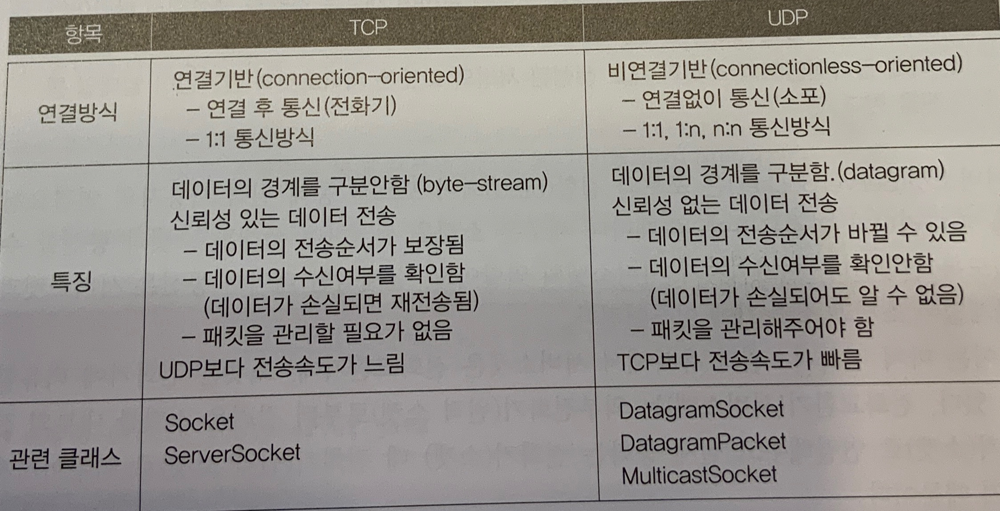
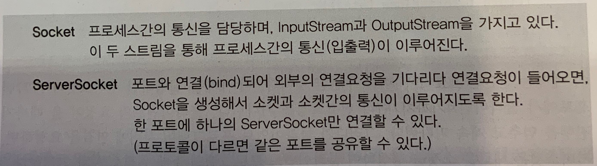

## < 소켓 프로그래밍 >
- 소켓 프로그래밍은 소켓을 이용한 통신 프로그래밍을 뜻하는데, 소켓이란 프로세스간의 통신에 사용되는 양쪽 끝단을 의미한다
- 서로 멀리 떨어진 두 사람이 통신하기 위해선 전화ㅏ기가 필요한 것처럼 프로세스간의 통신을 위해서는 소켓이 필요하다.

1. TCP와 UDP
- TCP/IP 프로토콜은 이기종 시스템간의 통신을 위한 표준 프로토콜로 프로토콜의 집합이다.
- TCP와 UDP는 전송 방식이 다르며, 각 방식에 따른 장단점이 있다.(TCP는 파일을 주고 받는데 적합)

2. TCP소켓 프로그래밍
- TCP소켓 프로그래밍은 클라이언트와 서버간의 일대일 통신이다.
- 포트 : 호스트(컴퓨터)가 외부와 통신을 하기 위한 통로로 하나의 호스트는 65536개의 포트를 가지고 있다
- 
- 정리 ) 서버소켓은 소켓간의 연결만 처리 실제 데이터는 소켓들끼리 서로 주고받는다. 소켓들이 데이터를 주고받는 연결통로는 입출력스트림이다.
