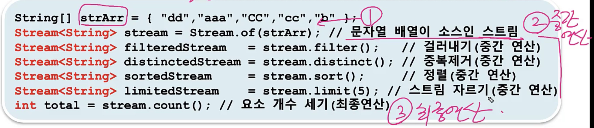
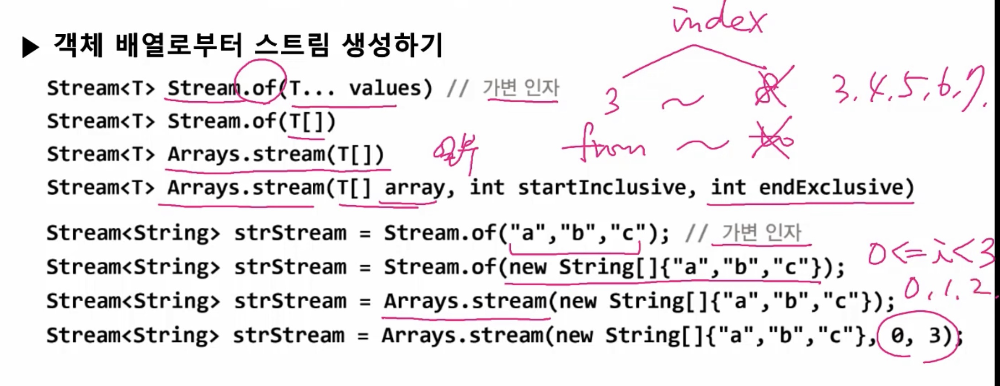
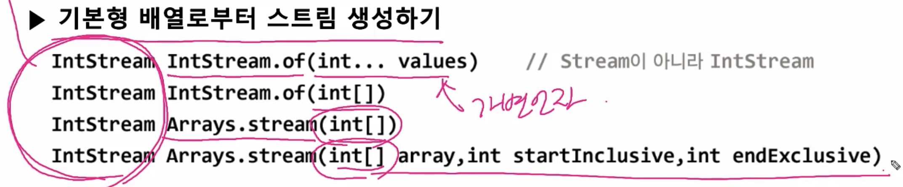
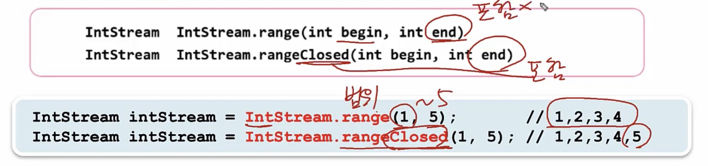
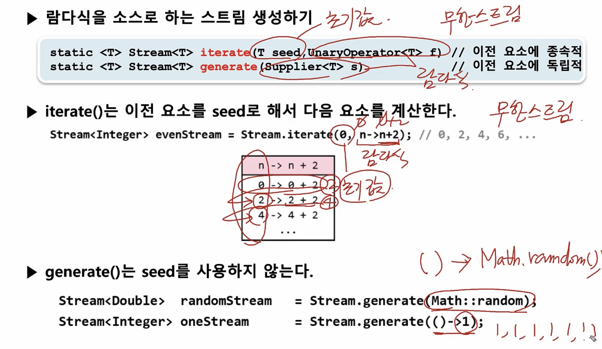
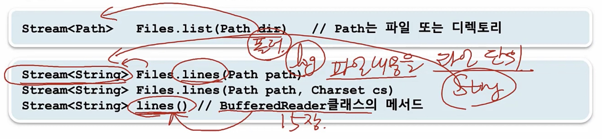
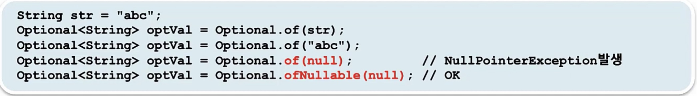
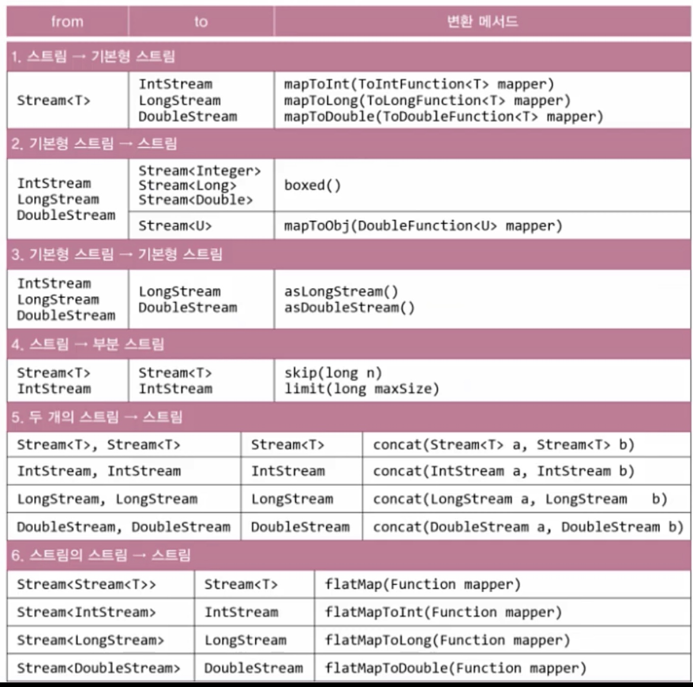
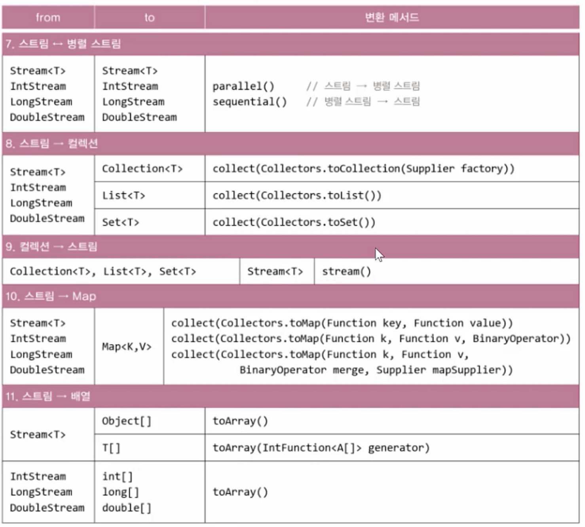

## < 스트림(Stream) : 데이터의 연속적인 흐름 >
- 다양한 데이터 소스를 표준화된 방법으로 다루기 위한 것 (데이터 소스 : 컬렉션(List, Set, Map), 배열)
- 위의 다양한 데이터 소스들로부터 Stream을 만들어서 쭉 똑같은 방식으로 작업을 처리할 수 있음
- 작업종료에는 두가지 순서가 있다
  1) 중간연산 : n번 가능 -> 원하는 결과를 얻기위해 여러번 연산하고
  2) 최종연산 : 1번 -> 최종적으로 마지막 1번 연산해서 결과를 얻음
- Stream 작업순서
  1) 스트림 만들기
  2) 중간연산(0~n번) : 연산결과가 스트림인 연산
  3) 최종연산(1번) : 연산결과가 스트림이 아님, 스트림의 모든 요소를 소모 -> 결과
```
ex)
        중복제거    5개자르기   정렬       출력
stream.distinct().limit(5).sorted().forEach(System.out.::println)
      [         중간 연산           ] [         최종 연산          ]
                  3번                          1번 
```


### 1. 스트림의 특징
- 스트림은 데이터 소스로부터 데이터를 읽기만 할 뿐 변경하지 않는다. (데이터의 원본은 변경하지 않는다)
- 스트림은 Iterator처럼 일회용이다(필요하면 다시 스트림을 생성해야 함)
- 최종 연산 전까지 중간연산이 수행되지 않는다. - 지연된 연산
- 스트림은 작업을 내부 반복으로 처리한다.
- 스트림의 작업을 병렬로 처리 - 병렬스트림 (멀티쓰레드)
- 기본형 스트림 - IntStream, LongStream, DoubleStream
- 오토박신 & 언박싱의 비효율이 제거됨(Stream<Integer>대신 IntStream사용)
- 숫자와 관련된 유용한 메서드를 Stream<T>보다 더 많이 제공 (T안에는 기본형 못들어가고 참조형만 들어갈 수 있음)

### 2. 스트림 만들기 - 컬렉션
1) 스트림 생성
2) 중간연산(0~n)
3) 최종연산(0~1)
- Collection인터페이스의 stream()으로 컬렉션을 스트림으로 변환
    - Stream<E> stream()  // Collection인터페이스의 메서드, 따라서 Collection인터페이스를 구현한 자손클래스인 List와 Set이 이 Stream메서드를 가지고 있다.

### 3. 스트림 만들기 - 배열
- 객체 배열로부터 스트림 생성하기

- 기본형 배열로부터 스트림 생성하기


### 4. 스트림 만들기 - 임의의 수
- 난수를 요소로 갖는 스트림 생성하기 
- 난수를 요소로 갖는 스트림은 무한스트림 따라서 limit로 자르거나 난수의 범위를 지정해주는 스트림을 생성하는 메서드를 사용해야한다.
- streamSize를 이용해 유한스트림으로도 변경 가능

### 5. 특정 범위의 정수를요소로 갖는 스트림 생성하기(IntStream, LongStream)


### 6. 스트림 만들기 - 람다식 iterate(), generate()
- 람다식을 소스로 하는 스트림 생성하기


### 7. 스트림 만들기 - 파일과 빈 스트림
- 파일을 소스로 하는 스트림 생성하기

- 비어있는 스트림 생성하기
```
Stream emptyStream = Stream.empty();    //  empty()는 빈 스트림을 생성해서 반환한다.
long count = emptyStream.count();       //  count의 값은 0
```

### 8. 스트림의 연산
- 스트림이 제공하는 기능 - 중간 연산과 최종 연산
    - 중간 연산 : 연산결과가 스트림인 연산, 반복적으로 적용가능
    - 최종 연선 : 연산결과가 스트림이 아닌 연산, 단 한번만 적용가능(스트림의 요소를 소모)
- 중간 연산의 핵심 : 스트림의 요소를 변환한다
  1) map()
  2) flatMap()

- 최종 연산의 핵심 : 스트림의 요소를 하나씩 줄여가면서(리듀싱) 계산한다, 스트림의 요소를 수집한다, 스트림의 요소를 수집
  1) reduce()
  2) collect()

### 9. 스트림의 중간 연산
- 스트림 자르기 - skip(), limit()
- 스트림의 요소 걸러내기 - filter(), distinct()
- 스트림 정렬하기 - sorted()
- Comparator의 comparing()으로 정렬 기준을 제공
- 추가 정렬 기준을 제공할 떄는 thenComparing()을 사용
- map(), ppeek(), flatmap()
  1) map() -> 변환
  2) peek() -> forEach()와 비슷 근데 peek는 중간연산 forEach는 최종연산
  3) flatmap() -> 변환 map()하고 비슷한대 차원을 줄여줌 스트림의 스트림을 -> 스트림으로 변환

- 스트림 요소 변환하기 - map()
- 스트림의 요소를 소비하지 않고 엿보기 - peek() - 디버깅용
- 스트림의 스트림을 스트림으로 변환 - flatMap() : ex) 문자열의 여러가지 배열을 하나의 문자열 배열로 바꾸는것

### 10. Optional<T>와 Optionallnt
- T타입 객체의 래퍼클래스 - Optional<T>  (래퍼클래스 : Integer, Long 타입의 값들을 가지고 있는 클래스)
- T타입의 참조변수를 가지고 있어 모든 종류의 객체 저장가능(null도)
- null을 직접다루는 것은 위험 NullPointerException이 발생할 수 있어서 
- Optional<T>는 null을 객체안에 담아서 간접적으로 다루기 때문에 NullPointerException이 발생할 위험을 피할 수 있고 null 체크를 위한 if문을 생략 할 수 있다.

#### 1) Optional<T>객체 생성하기
- Optional<T>객체를 생성하는 다양한 방법

- of()는 null을 넣을 수 없고 null을 넣으려면 ofNullable() 사용 
- null대신 빈 Optional<T>객체를 사용하자
```
Optional<String> optVal = null;   // X 바람직하지 않음
Optional<String> optVal = Optional.<String>empty();   //  OK, <String>생략 가능
```

#### 2) Optional<T>객체의 값 가져오기
- Optional객체의 값 가져오기 - get(), orElse(), orElseGet(), orElseThrow()
- isPresent() - Optional객체의 값이 null이면 false 아니면 true를 반환

#### 3) OptionalInt, OptionalLong, OptionalDouble
- 기본형 값을 감싸는 래퍼클래스 Optional<T>를 써도 되지만 성능을 높이기 위해서 위의 3개를 쓴다
- OptionalInt의 값 가져오기 - int getAsInt()
- 빈 Optional객체와의 비교 - int라서 기본값이 0 으로 저장되어있음 
- isPresent() : 0과 empty일때 이걸 구별하는 방법
```
OptinalInt opt = OptionalInt.of(0);         //    value = 0;
OptinalInt opt2 = OptionalInt.empty();      //    value = 0;  얘는 아무것도 저장되어있지 않은것임

Sysetm.out.println(opt.isPresent());    //  true
Sysetm.out.println(opt2.isPresent());    //  false
Sysetm.out.println(opt.equals(opt2));    //  false
```

### 11. 스트림의 최종연산
- 스트림의 최종연산 - forEach()
- 정리)
  - Stream의 연산 
    1) 중간연산 : n번 -> stream을 반환 (limit(), skip(), filter(), distinct(), map(), flatMap(), peek())
    2) 최종연산 : 1번 (스트림 요소를 소모해서 스트림이 닫히기 때문에 1번만 가능) -> int, boolean, optional을 반환 (forEach(), allMatch(), anyMatch(), noneMatch(), reduce(), collect(), findFirst(), findany())

- Stream의 모든 요소에 지정된 작업을 수행 - forEach(), forEachOrdered() 
  - parllel() 병렬 스트림시 여러쓰레드로 나눠 처리하는데 이때 순서가 보장이 안됨 근데 forEachOrdered()를 사용하면 순서가 보장됨

- 조건 검사 - allMatch(), anyMatch(), noneMatch()
  1) boolean allMatch : 모든 요소가 조건을 만족시키면 true
  2) boolean anyMatch : 한 요소라도 조건을 만족시키면 true
  3) boolean noneMatch : 모든 요소가 조건을 만족시키지 않으면 true

- 조건에 일치하는 요소 찾기 - findFirst(), findAny() - 결과가 null일 수 있어서 Optional<T> 사용
  1) Optional<T> findFirst() : 첫 번째 요소를 반환. 순차 스트림에 사용
  2) Optional<T> findAny() : 아무거나 하나를 반환. 병렬 스트림에 사용

- 스트림의 최종연산 - reduce()
- 스트림의 요소를 하나씩 줄여가며 누적연산(accumulator) 수행 - reduce() 
  - identity : 초기값
  - accumulator : 이전 연산결과와 스트림의 요소에 수행할 연산
  1) Optional<T> reduce(BinaryOperator<T> accumulator)      
  2) T           reduce(T identity, BinaryOperator<T> accumulator)


### 12. collect()와 Collectors
- collect()는 Collect를 매개변수로 하는 스트림의 최종연산
- 최종연산
  1) reduce() : 리듀싱 - 스트림 요소의 전체에 대한 리듀싱은 reduce()를 쓴다
  2) collect() : 그룹별 리듀싱 - 스트림 요소를 그룹별로 나눠서 리듀싱 할 때는 collect()를 쓴다

- Collector는 수집(collect)에 필요한 메서드를 정의해 놓은 인터페이스 - 직접 구현하지 않고 Collectors클래스를 가져다 쓰면됨 직접 구현할 일이 거의 없음
  - public interface Collector<T, A, R> { T의 요소를 A에 누적한 다음, 결과를 R로 변환해서 반환
  1) supplier() -> 누적할 곳(A)(StringBuilder sb = new StringBuilder(); - 초기화)  - 핵심
  2) accumulator() -> 누적방법(sb.append(s))   - 핵심
  3) combiner() -> 결합방법(병렬)
  4) finisher() -> 최종변환(R)

- 정리) collect() 는 최종연산, Collector는 인터페이스, Collectors는 클래스(Collector를 구현한 클래스)

- Collectors클래스는 다양한 기능의 컬렉터(Collector를 구현한 클래스)를 제공

#### 1) 스트림을 컬렉션, 배열로 변환
- 스트림을 컬렉션으로 변환 - toList(), toSet(), toMap(), toCollection()
- 스트림을 배열로 변환 - toArray() 
  - toArray() 괄호안에 매개변수가 없으면 앞에 배열의 타입을 Object[]로 해야된다.

#### 2) 스트림의 통계 - counting(), summingInt()
- 스트림의 통계정보 제공 - counting(), summingInt(), maxBy(), minBy(), ...

#### 3) 스트림을 리듀싱 - reducing()
- Collectors 의 리듀싱 : 얘는 전체가 아닌 그룹별 sum, 그룹별 count등이 가능하다
- 문자열 스트림의 요소를 모두 연결 - joining()

### 13. 스트림의 그룹화와 분할
- partitioningBy()는 스트림을 2분할 한다. (Collectors.partitioningBy())
- groupingBy()는 스트림을 n분할 한다.

### 14. 스트림의 그룹화 - groupingBy() - n분할
- 스트림의 요소를 그룹화

### 15. 스트림의 변환

